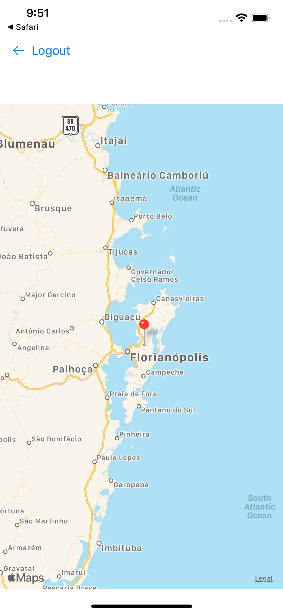

= VirtualTourist

This app allows users specify travel locations around the world, and create virtual photo albums for each location. The locations and photo albums are stored in Core Data. This app was made as part of the Udacity iOS Developer Nanodegree.

== Running
To run this app, you need to set up the `Secrets.json` file first in the following format:

[source,json]
----
include::VirtualTourist/Secrets.json.example[]
----

The values the above json should be replaced by actual API keys. For that, please request API keys at https://www.flickr.com/services/developer/api/[Flickr].

Once you have the keys, you can bootstrap the secrets file with:

[source,bash]
----
cp VirtualTourist/Secrets.json.example VirtualTourist/Secrets.json
----

and then you can modify `Secrets.json` in place.

Once your credentials are set, you can use Xcode 12 or greater to start the app.

== Logging In

Once you open the app, you will face the login screen:

The login uses Flickr OAuth, so you will be taken to their website where you can login with your credentials. Once you authorize the app on your browser, you will be redirected to VirtualTourist and see the map view where you can drop pins:

== Features

- You can drop pins anywhere on the map; a new pin is created on the chosen location
- The album view downloads images from Flickr for the chosen location
- You can delete pins and update all its images
- You can see the image in more detail by single tapping on it
- You can delete specific images from a location by double tapping on it

== Work Notes

=== Authentication
This app does not really need authentication to work with the Flickr API. However, initially I found the endpoint https://www.flickr.com/services/api/flickr.photos.geo.photosForLocation.html[flickr.photos.geo.photosForLocation] and only after I got it working with authentication and all the Flickr API signing requirements that I noticed it worked only for the images of the authenticated Flickr user. The actual endpoint now used is https://www.flickr.com/services/api/flickr.photos.search.html[flickr.photos.search] which does not require authentication for public photos.

=== Decoupling Core Data

Core Data automatically created classes are not what I prefer to work with. I need to keep unwrapping things, dealing with NSSet and casting results with `as! Pin` or `as! Photo`. I thought "I could decouple that, dealing with CoreData in some key classes and the rest of my codebase will only use strongly typed structs I define". That thought kind of worked, but I have some issues:

==== Deletion
How to delete efficiently when you don't have the object? Structs in the codebase contain an id that is available in the respective core data model. I wish I had an efficient way of deleting it with that id, like in SQL:

[source,sql]
----
delete from Pin
where id = 'SOME-ID';
----

Maybe I am too bad at googling with CoreData, but I couldn't find how. My solution ended up fetching the Pin objects, then in memory picking the one I want to delete, and then using that for deleting from the context. This approach is `O(n)`, so definitely not ideal.

==== Transformable

Can I use transformable instead of data for codable? I didn't invest much time researching this and I couldn't find it quickly. I also didn't do it for the UIImage data; this would be a nice next step.

==== Should I bother about decoupling Core Data?

That's what I wonder given the issues above. Have you had this problem? Want to talk or have a link/book for me to read? I would love to hear from you.

== License

See link:LICENSE[LICENSE]

== Credits

- Icons made by https://www.flaticon.com/authors/catkuro[catkuro] from https://www.flaticon.com/[Flaticon]
- Photo Album images by https://www.flickr.com[flickr]
